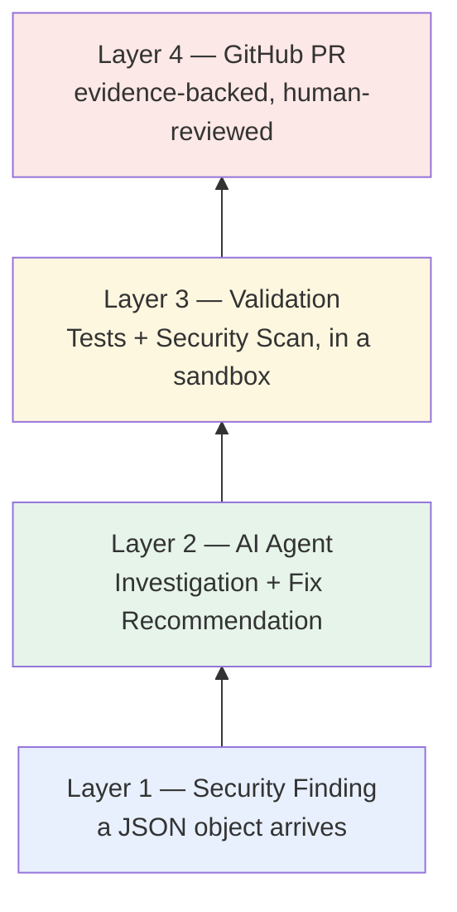
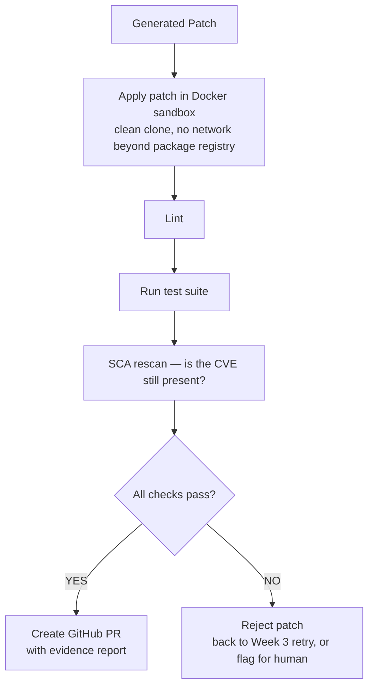
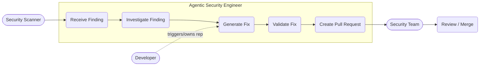
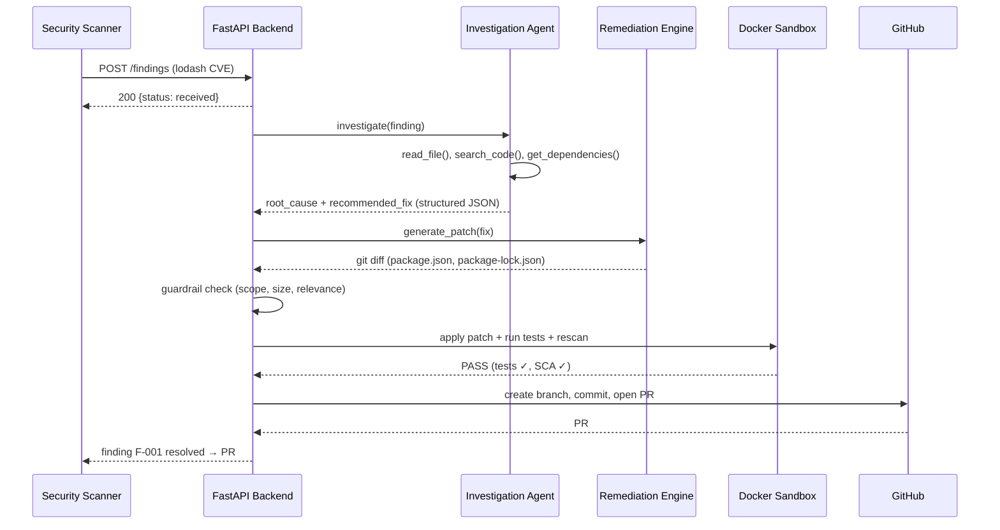
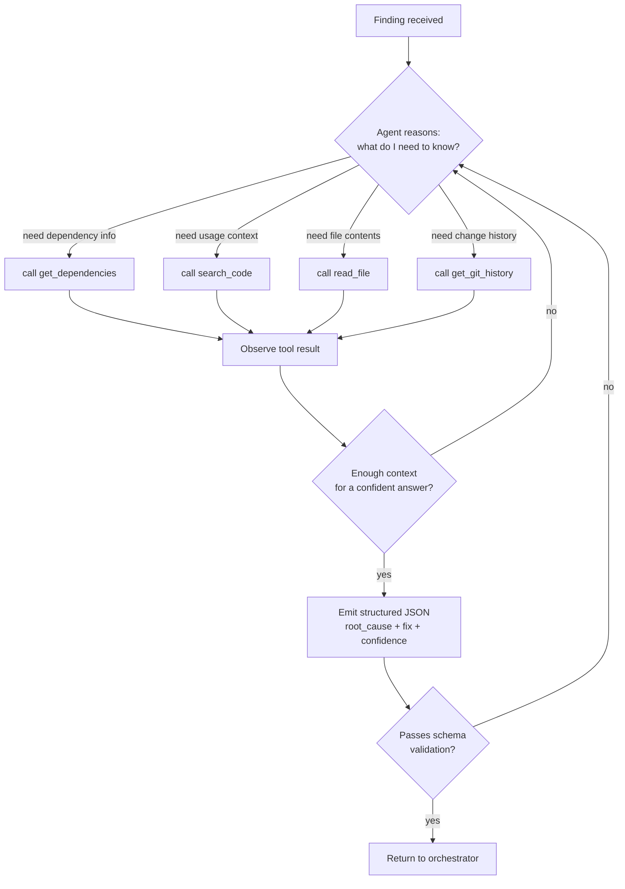
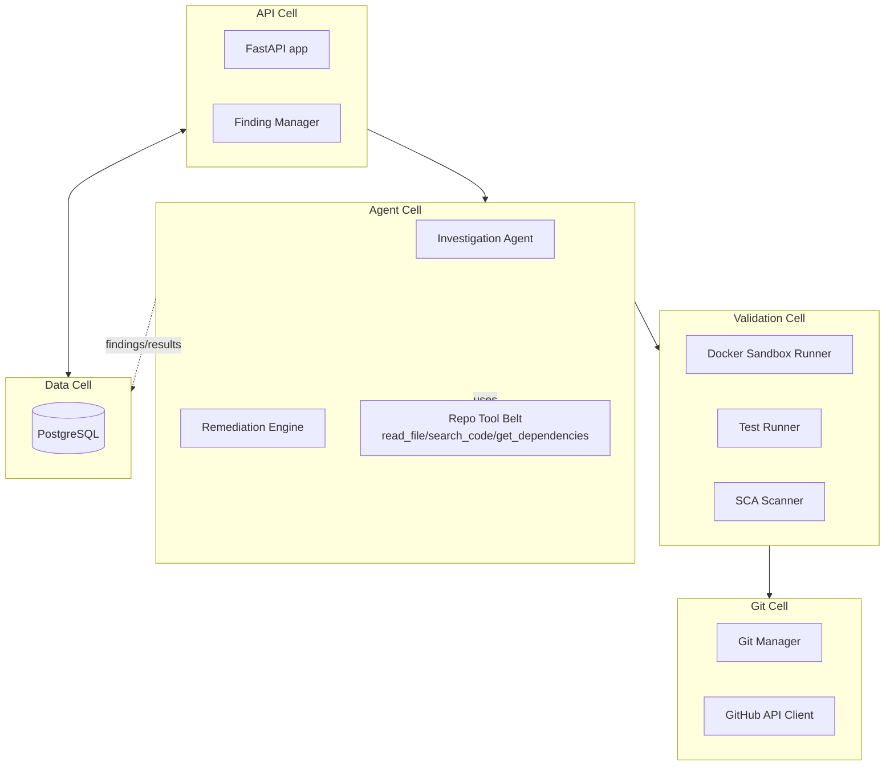
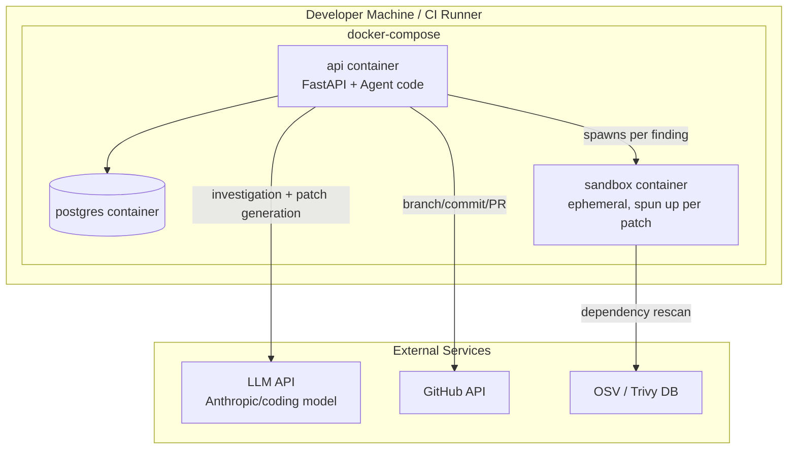
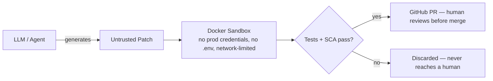
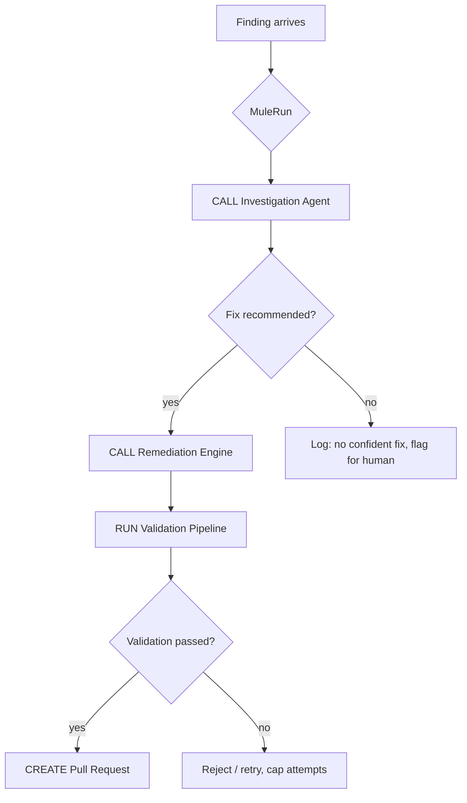

# OpenShomer — Phase-by-Phase Implementation Plan

> **Golden rule:** don't build "the Security Engineer." Build **one junior security engineer's workflow**, end-to-end, for **one vulnerability type**, first. Everything else comes after that works reliably.

**Definition of your MVP milestone (memorize this sentence):**
> *Given one security finding in a GitHub repository, the system can investigate it, generate a minimal fix, verify the fix in an isolated environment, and create an evidence-backed PR.*

You are not moving to SAST, Terraform, Kubernetes, IAM, or attack graphs until that sentence is true and demoable, reliably, on a real repo.

---

## 0. What you are explicitly NOT building yet

Cross these off your mental list until v0.1 is demoed:

```
AWS · Azure · GCP · Kubernetes · Terraform · IAM
Neo4j · DAST · SBOM · 12 agents · MuleRun-as-brain
Password/credential guessing against live systems
```

The only exception: MuleRun as a dumb **traffic controller** (see §5), not a reasoning engine.

---

## 1. The 4 layers (build bottom → top)



Each layer must work **in isolation** (with fake input for the layer above it) before you wire it to the next one. This is the single biggest thing that keeps this project simple.

---

## 2. Week-by-week milestones

### Week 0 — Demo repo (do this first, before any code)

**Goal:** something for the agent to fix.

- [ ] Create `demo-app/` with a real `package.json` pinning a known-vulnerable `lodash` version
- [ ] Add 1–2 files in `src/` that actually `require('lodash')` so the fix is meaningful
- [ ] Add a trivial test in `tests/` that passes today (this is what "Tests: PASS" will mean later)
- [ ] Push it as its own throwaway GitHub repo — this is your target, not `open-shomer` itself

**Definition of Done:** `npm install && npm test` passes on a repo with a known CVE in its lockfile.

```
demo-app/
├── package.json          ← "lodash": "4.17.20"
├── package-lock.json
├── src/
│   ├── app.js
│   └── payment.js
└── tests/
    └── payment.test.js
```

---

### Week 1 — Ingest a finding

**Goal:** a finding goes in, an acknowledgment comes out. Nothing smart yet.

- [ ] `POST /findings` endpoint (FastAPI) that accepts the finding JSON below and stores it (start with an in-memory dict or a single Postgres table — don't design the schema yet, one table is enough)
- [ ] `GET /findings/{id}` to read it back
- [ ] Log every finding received

```json
{
  "id": "F-001",
  "type": "DEPENDENCY_VULNERABILITY",
  "severity": "HIGH",
  "package": "lodash",
  "installed_version": "4.17.20",
  "fixed_version": "4.17.21",
  "repository": "your-username/demo-app"
}
```

```python
from fastapi import FastAPI
app = FastAPI()

@app.post("/findings")
def receive_finding(finding: dict):
    print("Received:", finding)
    return {"status": "received", "finding_id": finding["id"]}
```

**Stop here until this works.** No agent, no GitHub, no Docker yet.

**Definition of Done:** `curl -X POST localhost:8000/findings -d @finding.json` returns `{"status": "received", ...}` and you can fetch it back.

---

### Week 2 — Investigation Agent

**Goal:** turn the finding into a structured root-cause + fix recommendation.

- [ ] Clone the target repo locally (`GitPython` or plain `git clone` to a temp dir)
- [ ] Give the agent a **small, fixed toolset** — not open filesystem access:
  ```python
  read_file(path) -> str
  search_code(query) -> list[Match]
  get_dependencies() -> dict
  get_git_history(path) -> list[Commit]
  list_files(dir) -> list[str]
  ```
- [ ] Prompt the LLM to call these tools, then **force structured output** — use function calling / a Pydantic schema, never free text:
  ```json
  {
    "finding": "F-001",
    "root_cause": "Outdated lodash dependency",
    "affected_files": ["package.json", "package-lock.json"],
    "recommended_fix": "Upgrade lodash to 4.17.21",
    "confidence": 0.96,
    "risk": "HIGH"
  }
  ```
- [ ] If the model's output doesn't validate against the schema, **reject and retry** — don't pass bad data downstream.

**Definition of Done:** given `finding.json`, the agent returns a valid, schema-checked JSON object with the correct root cause, without a human in the loop.

---

### Week 3 — Remediation + patch guardrails

**Goal:** generate a patch, then treat it as hostile until proven otherwise.

- [ ] Feed the investigation result to the remediation model (Qoder, or any coding model) with a **narrow instruction**: "only touch `affected_files`, make the smallest possible change"
- [ ] Capture the result as a **git diff**, not as "the model edited files somewhere"
- [ ] Run the diff through a guardrail check *before* it ever reaches validation:

| Check | Reject if... |
|---|---|
| Scope | Any file outside `affected_files` was touched |
| Size | Diff touches more lines than a sane threshold (e.g. >20 for a dependency bump) |
| Relevance | The diff doesn't mention the package/CVE in question |
| Lockfile consistency | `package.json` changed but `package-lock.json` didn't (or vice versa) |

```diff
- "lodash": "4.17.20"
+ "lodash": "4.17.21"
```

- [ ] On guardrail failure → discard patch, regenerate (cap retries at ~2–3, then fail the finding as "needs human")

**Definition of Done:** a minimal, correct 2-file diff is produced for the demo repo, and you can prove the guardrail actually rejects a bad patch (test it by deliberately prompting a broad "refactor the file" change and confirming it's blocked).

---

### Week 4 — Validation + PR (this is your actual product)

**Goal:** nothing reaches a human without being proven to work.



- [ ] Docker sandbox: fresh clone + patch applied + `npm ci && npm test`
- [ ] Re-run the SCA scanner (OSV/Trivy) inside the sandbox — confirm the specific CVE is gone
- [ ] On full pass, create a branch, commit, and open a PR via the GitHub API with a report like:

```
🔐 Security Remediation
Finding: F-001 (HIGH)
Root Cause: lodash 4.17.20 contains a known vulnerability
Fix: lodash 4.17.20 → 4.17.21
Validation: ✓ tests  ✓ SCA  ✓ dependency resolution
Files changed: 2
Status: READY FOR HUMAN REVIEW
```

**Definition of Done:** run `security-agent scan` end-to-end against `demo-app` and get a real, mergeable PR with the report above — repeatably, not just once by luck.

---

## 3. Diagrams

### 3.1 Use case diagram



**Actors:** Security Scanner (submits findings), Developer (owns the repo the fix lands in), Security Team (reviews/merges the PR). Note there is **no actor for "guess credentials"** — that's out of scope by design.

### 3.2 User scenario (sequence diagram — this is your single demo, spelled out)



### 3.3 Agentic reasoning diagram (Investigation Agent's internal loop)



This is a bounded ReAct-style loop with a **fixed, whitelisted toolset** — the agent can never run arbitrary shell commands or touch files outside the cloned repo.

### 3.4 Component diagram ("cells" of the system)



Each "cell" is a self-contained module with one job — you should be able to unit-test each one with mocked inputs before wiring the whole pipeline together (this maps directly to `app/api`, `app/agents`, `app/validation`, `app/github`).

### 3.5 Deployment diagram (local/dev, and where it goes in Docker Compose)



Key point: the **sandbox container is ephemeral** — spun up per patch attempt, torn down after. It's the only place untrusted, AI-generated code actually executes. The API container never runs generated code directly.

### 3.6 Security boundary (why the sandbox matters)



This is also the answer to the secrets question from your team chat: the agent operates inside this boundary with **zero access to real credentials**. If you later add hardcoded-secret detection (v0.2, see below), it's a static pattern/entropy scan over the diff — it flags "this looks like a secret," redacts the value in the report, and never attempts to use or guess it.

---

## 4. What MuleRun actually does (don't let it become "the brain")



MuleRun is the **workflow controller** — it calls specialized components in order and handles pass/fail branching. It does not reason about vulnerabilities itself.

---

## 5. Where hardcoded/weak secrets fit (v0.2, not MVP)

To directly answer the team-chat question: don't build "password guessing." Build a **secrets-pattern scanner** as one SAST rule type, later:

- Runs a regex + entropy check over the diff/repo (same approach as `gitleaks`/`detect-secrets`)
- Flags patterns like `password = "..."`, `AWS_SECRET_ACCESS_KEY = "..."`, or unusually high-entropy strings near variable names like `key`/`token`/`secret`
- **Never** stores or displays the actual secret value in the report — redact it (`AKIA****...`)
- **Never** attempts to use, verify, or guess the credential against any live system
- Suggests the fix pattern (move to env var / secrets manager), it doesn't rotate secrets itself in v0.2

This slots into the same Layer 2→3→4 pipeline as the dependency finding — same investigation → fix → validate → PR shape, just a different finding `type`.

---

## 6. Definition of Done for the whole MVP

You are done with v0.1 when you can run this, reliably, more than once, on a real repo:

```
$ security-agent scan demo-app

1. Finding received (lodash CVE)
2. Repository investigated
3. Root cause explained
4. Patch generated (2 files)
5. Guardrail check passed
6. Sandbox: tests PASS, SCA PASS
7. GitHub PR created — READY FOR HUMAN REVIEW
```

Only once that's boring and repeatable do you open the roadmap back up to v0.2 (SAST/secrets) → v0.3 (Terraform) → v0.4 (cloud) → v0.5 (attack graph), as laid out in the main README.
