<div align="center">

# 🛡️ OpenShomer

**An open-source agentic security engineer that investigates security findings, generates minimal fixes, validates them, and creates evidence-backed pull requests.**

[](#status)
[](#license)
[](#quick-start)
[](#contributing)

[Why OpenShomer](#why-openshomer) •
[Architecture](#architecture) •
[Quick Start](#quick-start) •
[Roadmap](#roadmap) •
[Contributing](#contributing)

</div>

---

## What is OpenShomer?

Security scanners are good at **finding** vulnerabilities. They are not good at **fixing** them.

OpenShomer sits between the security finding and the developer, closing the loop that most tools leave open:

```
Finding → Alert                              (what most tools do)
Finding → Investigate → Fix → Validate → PR  (what OpenShomer does)
```

Every AI-generated change is treated as **untrusted** until it passes tests, static analysis, and dependency scanning inside an isolated sandbox — only then does OpenShomer open a pull request for human review.

---

## Why OpenShomer?

A typical remediation workflow today looks like this:

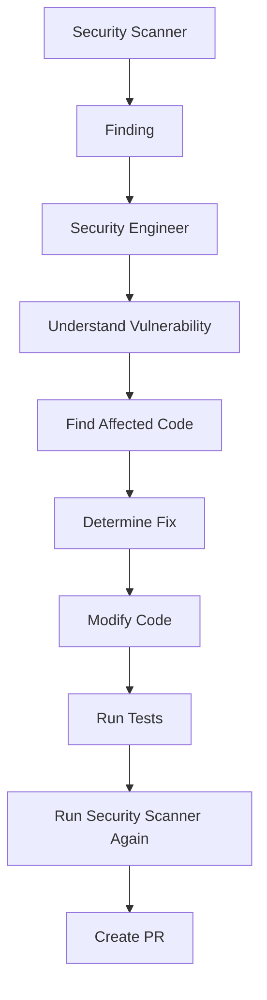

This is repetitive, slow, and doesn't scale with the number of findings a modern codebase generates.

OpenShomer automates the entire loop as an **agentic security engineer**, while keeping AI-generated code on a short leash — nothing reaches a developer without passing deterministic validation.

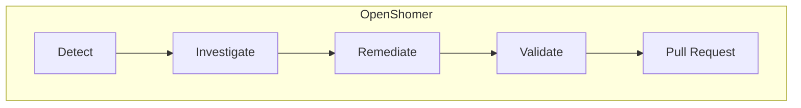

---

## MVP: Vulnerable Dependencies

The first version of OpenShomer focuses on a single, well-scoped workflow: **dependency vulnerabilities**.

**1. A scanner reports a finding:**

```json
{
  "id": "F-001",
  "type": "DEPENDENCY_VULNERABILITY",
  "severity": "HIGH",
  "package": "lodash",
  "installed_version": "4.17.20",
  "fixed_version": "4.17.21",
  "repository": "payment-api",
  "scanner": "osv"
}
```

**2. OpenShomer investigates and returns a structured result:**

```json
{
  "finding": "F-001",
  "root_cause": "Outdated lodash dependency",
  "affected_files": ["package.json", "package-lock.json"],
  "recommended_fix": "Upgrade lodash to 4.17.21",
  "confidence": 0.96,
  "risk": "HIGH"
}
```

**3. The remediation engine generates a minimal patch:**

```diff
- "lodash": "4.17.20"
+ "lodash": "4.17.21"
```

**4. The patch is validated inside a sandbox:**

```
✓ Patch inspection
✓ Dependency resolution
✓ Unit tests
✓ Security scan
✓ Vulnerability no longer detected
```

**5. OpenShomer opens a PR for human review.**

---

## Architecture

The MVP architecture is intentionally small and linear.

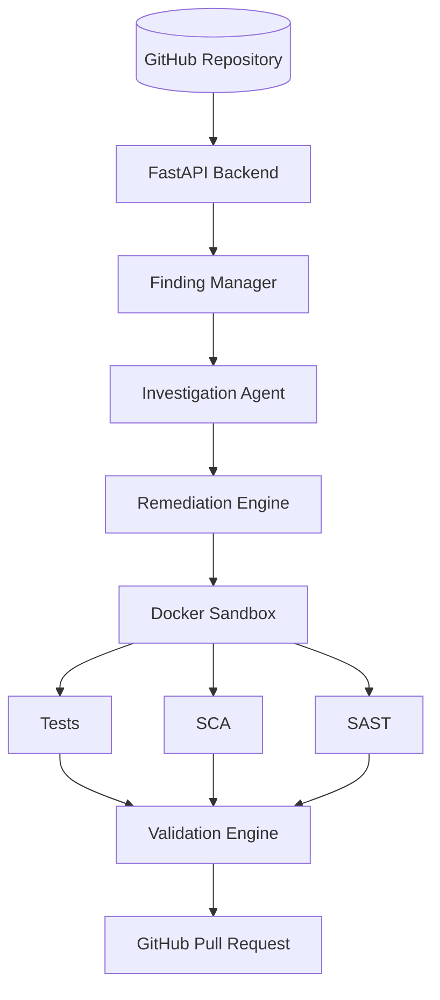

### Core Workflow

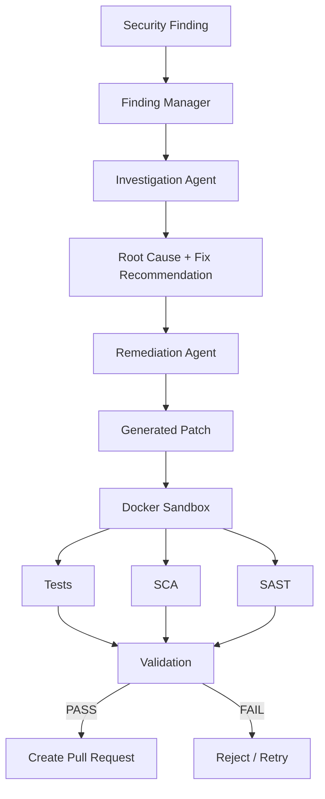

### Security Model

AI-generated changes are never trusted by default. Every patch is boxed into a sandbox and must pass all deterministic checks before it can reach a human reviewer.

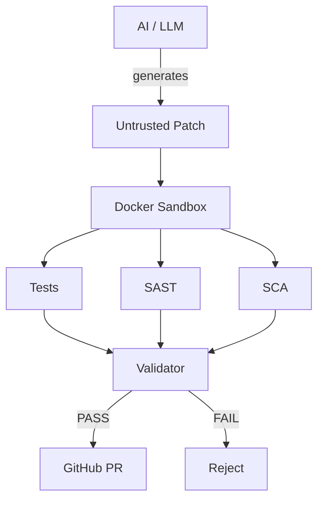

### Components

| Component | Purpose | MVP Technology |
|---|---|---|
| API | Receive findings and control workflow | FastAPI |
| Finding Manager | Store and track security findings | Python + PostgreSQL |
| Investigation Agent | Analyze repository and determine root cause | Python + LLM |
| Remediation Engine | Generate security fixes | Qoder / coding model |
| Git Manager | Branches, commits and PRs | GitHub API |
| Sandbox | Safely execute generated changes | Docker |
| Test Runner | Verify application behavior | Project test framework |
| SCA | Detect dependency vulnerabilities | OSV / Trivy |
| SAST | Static security validation | Semgrep |
| Orchestration | Coordinate workflow | MuleRun |
| Database | Findings, investigations, validation results | PostgreSQL |

---

## Investigation Agent

The Investigation Agent understands a finding using controlled repository tools, not free-form file access:

```
read_file()
search_code()
get_dependencies()
get_git_history()
list_files()
```

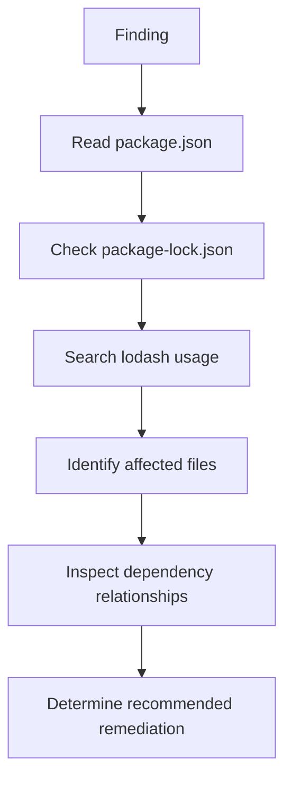

It returns a structured result — never free text — so downstream steps can validate and act on it programmatically.

---

## Remediation & Patch Review

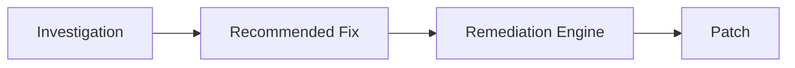

Before validation, every patch is checked against a short list of guardrails:

- Is the change related to the finding?
- Is the patch minimal?
- Were unexpected files modified?
- Did the dependency lock file change correctly?
- Did the generated code touch unrelated functionality?

If any guardrail fails, the patch is rejected and regenerated rather than passed downstream.

---

## Validation Pipeline

A patch is never considered successful just because an LLM produced it.

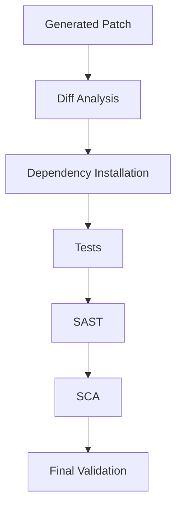

**Example validation report:**

```
Patch:
    package.json
    package-lock.json

Tests:     PASS
SAST:      PASS
SCA:       PASS

Original vulnerability: RESOLVED
Unexpected changes:     NONE

Result: APPROVED FOR PR
```

---

## API

### Submit a Security Finding

```
POST /findings
Content-Type: application/json
```

**Request:**

```json
{
  "id": "F-001",
  "type": "DEPENDENCY_VULNERABILITY",
  "severity": "HIGH",
  "package": "lodash",
  "installed_version": "4.17.20",
  "fixed_version": "4.17.21",
  "repository": "payment-api"
}
```

**Response:**

```json
{
  "status": "received",
  "finding_id": "F-001"
}
```

---

## Project Structure

```
open-shomer/
│
├── app/
│   ├── api/
│   │   ├── findings.py
│   │   └── repositories.py
│   │
│   ├── agents/
│   │   ├── investigator.py
│   │   └── remediation.py
│   │
│   ├── validation/
│   │   ├── tests.py
│   │   ├── sast.py
│   │   └── sca.py
│   │
│   ├── github/
│   │   ├── branches.py
│   │   ├── commits.py
│   │   └── pull_requests.py
│   │
│   ├── models/
│   │   └── findings.py
│   │
│   └── main.py
│
├── tests/
├── demo/
│   └── vulnerable-app/
├── docker/
│   └── sandbox/
│
├── requirements.txt
├── docker-compose.yml
└── README.md
```

---

## Quick Start

### Requirements

- Python 3.11+
- Docker
- Git
- A GitHub account and repository
- LLM / coding model credentials

### Setup

```bash
# Clone the repository
git clone https://github.com/<your-username>/open-shomer.git
cd open-shomer

# Create a virtual environment
python -m venv .venv
source .venv/bin/activate

# Install dependencies
pip install -r requirements.txt

# Start the API
uvicorn app.main:app --reload
```

The API is available at **http://localhost:8000**, with interactive docs at **http://localhost:8000/docs**.

---

## Roadmap

| Version | Focus | Highlights |
|---|---|---|
| **v0.1** | Dependency Remediation | Finding ingestion, repo investigation, dependency fix, tests, SCA, GitHub PR |
| **v0.2** | SAST Remediation | SQL injection, command injection, path traversal, hardcoded secrets, unsafe deserialization |
| **v0.3** | Infrastructure Security | Terraform, Docker, Kubernetes manifests |
| **v0.4** | Cloud Security | AWS, Azure, GCP — IAM, security groups, storage, secrets |
| **v0.5** | Security Graph | Cross-environment attack path reasoning |

### v0.1 — Dependency Remediation *(current focus)*

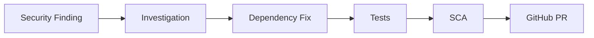

**Milestones**
- [ ] Finding ingestion
- [ ] GitHub repository access
- [ ] Repository investigation
- [ ] Dependency analysis
- [ ] Fix recommendation
- [ ] Patch generation
- [ ] Diff validation
- [ ] Docker sandbox
- [ ] Unit tests
- [ ] SCA validation
- [ ] GitHub PR creation

### v0.2 — SAST Remediation

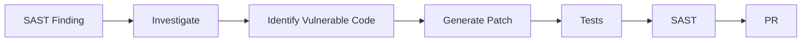

Targets: SQL injection, command injection, path traversal, hardcoded secrets, unsafe deserialization.

### v0.3 — Infrastructure Security

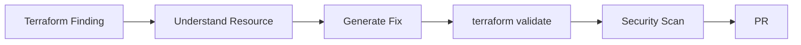

Targets: Terraform, Docker, Kubernetes.

### v0.4 — Cloud Security

Expands into AWS, Azure, and GCP: IAM, security groups, storage, secrets, and other cloud resources.

### v0.5 — Security Graph

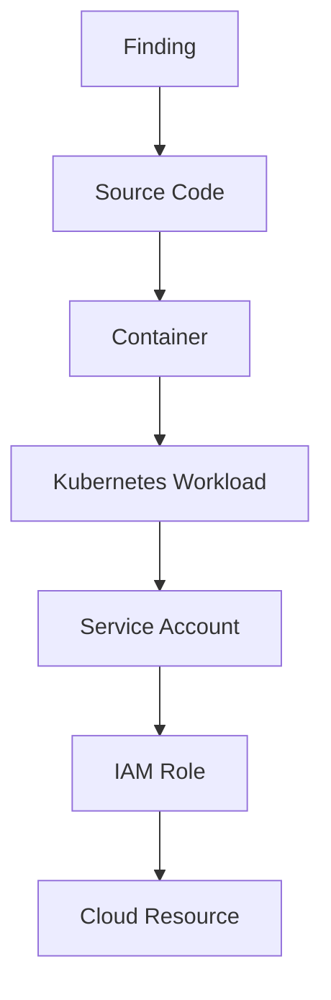

Connects findings across the environment to reason about attack paths instead of treating every vulnerability as an isolated alert.

---

## Long-Term Vision

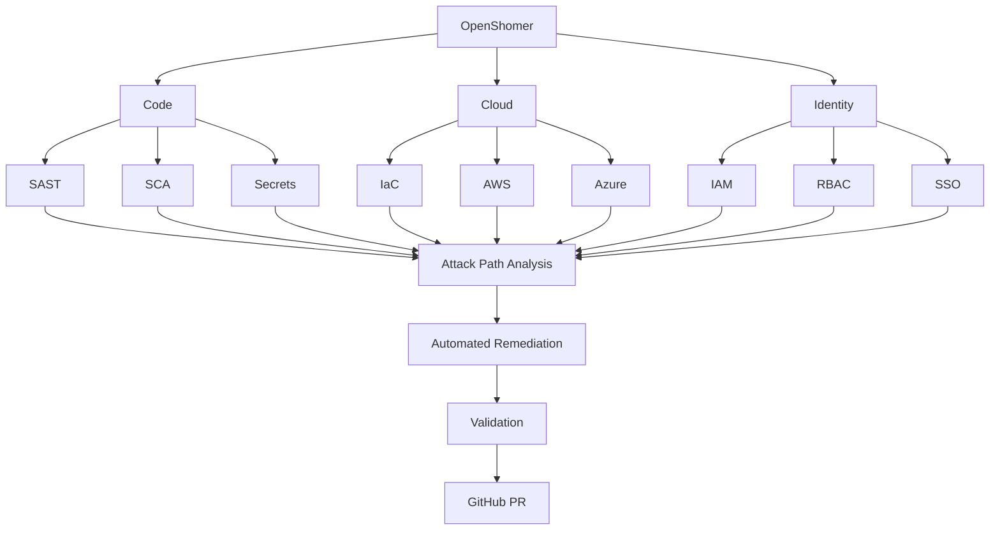

The principle stays constant at every layer: **Investigate → Remediate → Validate → Review.**

---

## Design Philosophy

**1. Start narrow.** Solve one workflow extremely well before expanding:
`ONE vulnerability → ONE investigation workflow → ONE remediation workflow → ONE validation pipeline → ONE reliable PR`

**2. AI should not be trusted blindly.** LLMs are reasoning engines, not security validators:
`LLM → Generate → Validate → Verify → Human Review`

**3. Deterministic systems enforce security.**

| Use AI for | Use deterministic tools for |
|---|---|
| Investigation | Tests |
| Reasoning | SAST |
| Code understanding | SCA |
| Remediation suggestions | Diff validation, dependency resolution, policy enforcement |

This separation is fundamental to the architecture.

---

## What OpenShomer Is Not

OpenShomer is not another vulnerability scanner. Scanners answer *"what is vulnerable?"* OpenShomer answers *"what is vulnerable, why, how should it be fixed, did the fix work, and can it safely be proposed to a developer?"*

| Traditional Scanner | OpenShomer |
|---|---|
| Detect | Detect + Investigate |
| Report | Explain root cause |
| Alert | Recommend remediation |
| Developer fixes manually | Generate patch |
| Developer tests manually | Automated validation |
| Finding remains open | Verified PR |
| Tool-centric | Workflow-centric |

---

## Technology Stack

- **Backend:** Python, FastAPI
- **Agent:** Python, LLM / coding model
- **Security:** Semgrep, OSV, Trivy
- **Execution:** Docker
- **Database:** PostgreSQL
- **Source Control:** Git, GitHub API
- **Orchestration:** MuleRun
- **Future:** Neo4j, Kubernetes, Cloud APIs

---

## Contributing

Contributions are welcome. Good first contributions include:

- Adding support for another vulnerability type
- Adding a new security scanner
- Improving repository investigation tools
- Adding validation rules
- Improving GitHub integration
- Adding test cases
- Improving documentation
- Building new remediation strategies

For major architectural changes, please open an issue to discuss the approach first.

### Development Principles

When adding functionality, ask:

1. Does this solve a real security workflow?
2. Can the behavior be tested?
3. Can AI output be validated?
4. What happens when the AI is wrong?
5. Can the operation be safely rolled back?
6. Does the change introduce unnecessary permissions?
7. Can the system provide evidence for its decision?

Security automation should optimize for **safe correctness**, not simply automation.

---

## Status

**Project Status:** Early Development / MVP

- [x] Architecture defined
- [x] MVP workflow defined
- [x] Dependency remediation selected as first target
- [ ] Finding ingestion
- [ ] Repository investigation
- [ ] Remediation
- [ ] Validation
- [ ] GitHub PR automation

---

## License

This project will be released under an open-source license. License details will be added when the initial repository is published.

---

<div align="center">

**OpenShomer**

*Investigate security findings. Generate the fix. Prove it works. Open the PR.*

</div>
