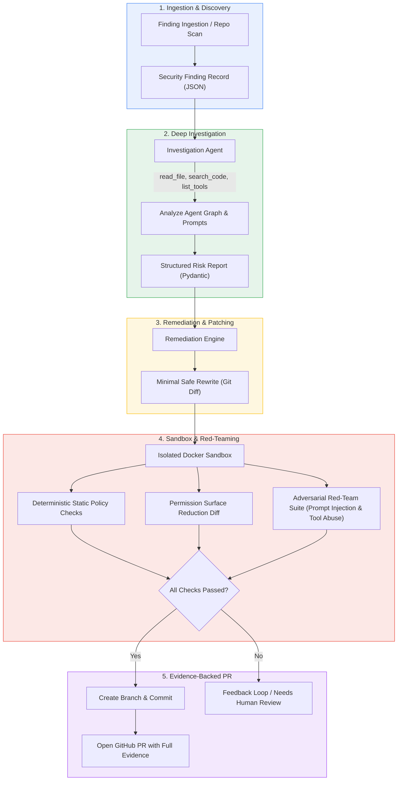
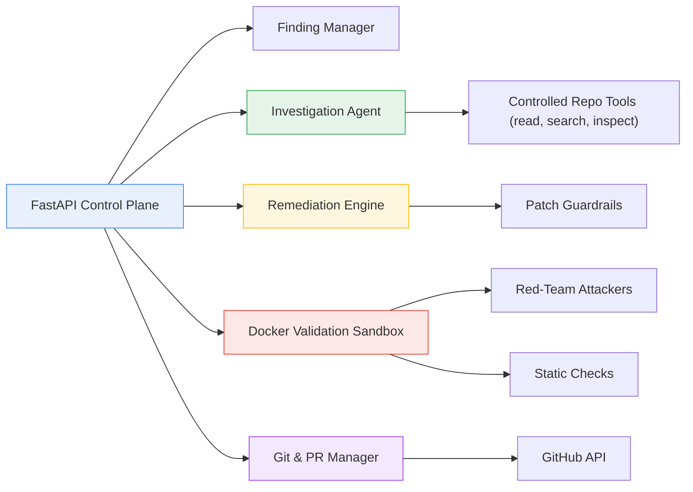
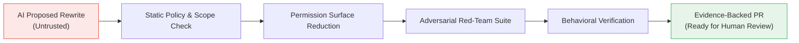

# OpenShomer

**An open-source agentic security engineer for LLM system prompts, agent configs, tool definitions, and MCP servers.**

OpenShomer discovers risky patterns in AI agent configurations, investigates the full agent graph, generates minimal safe rewrites, validates them with adversarial red-teaming inside an isolated Docker sandbox, and opens evidence-backed pull requests.

> Detection is not enough. OpenShomer closes the loop: **Find → Investigate → Rewrite → Red-team → Prove → PR**.

---

## Architecture & Workflows

### End-to-End Remediation Pipeline



### Component Architecture



---

## Why OpenShomer?

Traditional AppSec tools ignore the modern AI-agent attack surface:

- System prompts that are overly permissive or susceptible to jailbreaks
- Tools and MCP servers with excessive file, shell, network, or database privileges
- Missing human-in-the-loop (HITL) approval gates on destructive operations
- Indirect prompt-injection and data-exfiltration surfaces
- Overly broad agent skills that can be hijacked

Most existing security tools only **detect** and generate noisy alerts. Almost nothing **remediates** with verifiable proof.

OpenShomer treats AI agent configuration as first-class code that must be investigated, fixed, and proven safe before it reaches a human reviewer.

```
Traditional:  Risky Prompt / Config → Issue / Alert (Noise)
OpenShomer:   Risky Prompt / Config → Investigate → Minimal Rewrite → Adversarial Sandbox Validation → Evidence-backed PR
```

---

## MVP Summary (v0.1)

The first version is deliberately narrow and high-confidence: **close the loop on the most common and dangerous AI-agent configuration risks.**

### What OpenShomer Does in the MVP
- **Ingests / Scans** findings about system prompts, tool definitions, and MCP server configurations
- **Investigates** the agent codebase using strictly controlled, read-only tools
- **Generates** a minimal safe rewrite targeting only affected configuration files
- **Validates** the rewrite inside an isolated Docker sandbox using:
  - Static permission checks & policy diffs
  - Adversarial red-team suite (prompt injection + tool abuse tests)
- **Opens** a GitHub Pull Request only if every single check passes, complete with cryptographic/execution evidence

### Explicitly Out of Scope for MVP
- Full multi-agent orchestration graphs (beyond single agent + tools)
- Full RAG & vector database retrieval pipelines
- Runtime monitoring / live in-flight agent firewalls
- Auto-merging pull requests without human review

---

## Security Model



- **Zero Implicit Trust:** AI output is never trusted by default.
- **Deterministic Disposing:** AI proposes patches, but deterministic rules and adversarial red-teaming decide acceptance.
- **Minimal Blast Radius:** Patches are strictly scoped to affected configuration files.
- **Human Authority:** Human reviewers retain the final merge decision on all generated PRs.

---

## Example Flow

### 1. Input Finding
```json
{
  "id": "SHOMER-001",
  "type": "OVER_PERMISSIONED_TOOL",
  "severity": "HIGH",
  "file": "agent/tools.yaml",
  "tool": "run_shell",
  "issue": "Shell tool has no human approval gate and unrestricted command scope",
  "repository": "customer-support-agent"
}
```

### 2. Investigation Result
```json
{
  "finding": "SHOMER-001",
  "root_cause": "run_shell tool lacks approval gate and command allow-list",
  "affected_files": ["agent/tools.yaml", "prompts/system.md"],
  "recommended_fix": "Add human-in-the-loop gate + restrict to safe command prefix",
  "confidence": 0.95,
  "risk": "HIGH"
}
```

### 3. Minimal Rewrite Diff
```diff
- name: run_shell
-   description: Execute any shell command
-   permissions: ["shell:unrestricted"]
+ name: run_shell
+   description: Execute approved shell commands only
+   permissions: ["shell:restricted"]
+   requires_approval: true
+   allowed_prefixes: ["ls", "cat", "grep", "echo"]
```

### 4. Validation Report
```
✓ Permission surface reduced: shell:unrestricted -> shell:restricted
✓ Guardrails passed: Scope and file size limits respected
✓ Adversarial injection tests: 12/12 blocked
✓ No new high-risk capabilities introduced
Result: APPROVED FOR PR
```

---

## Project Structure (MVP)

```
OpenShomer/
├── app/
│   ├── api/
│   │   ├── findings.py
│   │   └── repositories.py
│   ├── agents/
│   │   ├── investigator.py
│   │   └── remediation.py
│   ├── validation/
│   │   ├── static.py
│   │   ├── redteam.py
│   │   └── sandbox.py
│   ├── github/
│   │   ├── branches.py
│   │   ├── commits.py
│   │   └── pull_requests.py
│   ├── models/
│   │   └── findings.py
│   └── main.py
├── redteam/
│   └── suites/                  # Adversarial test cases
├── demo/
│   └── vulnerable-agent/        # Sample risky agent for testing
├── docker/
│   └── sandbox/
├── tests/
├── requirements.txt
├── docker-compose.yml
└── README.md
```

---

## Quick Start (Planned)

```bash
# Clone the repository
git clone https://github.com/kavix/OpenShomer.git
cd OpenShomer

# Set up Python virtual environment
python -m venv .venv
source .venv/bin/activate
pip install -r requirements.txt

# Start OpenShomer API
uvicorn app.main:app --reload
```

The API will be available at `http://localhost:8000` with interactive Swagger docs at `http://localhost:8000/docs`.

---

## Roadmap

| Version | Focus                              | Highlights                                      |
|---------|------------------------------------|-------------------------------------------------|
| **v0.1**    | Core Loop (MVP)                    | System prompts + tool/MCP configs, basic red-team, GitHub PRs |
| v0.2    | Richer Agent Graphs                | Multi-tool agents, skill files, LangChain/LlamaIndex support |
| v0.3    | Advanced Red-Teaming               | Adaptive attackers, multi-turn jailbreaks, tool-chaining attacks |
| v0.4    | RAG & Memory Security              | Vector store permissions, retrieval prompt hardening |
| v0.5    | Runtime Feedback Loop              | Ingest live agent traces and close the loop from production |

---

## What OpenShomer Is Not

- **Not another passive scanner** that creates issue spam without fixes
- **Not a general-purpose coding agent**
- **Not an in-flight runtime proxy or firewall** (that sits at the runtime layer)
- **Not a replacement for human security review**

OpenShomer is the autonomous remediation engineer between **"a risky agent config was detected"** and **"a verified, minimal, reviewable fix exists."**

---

## Contributing

Contributions are welcome! Suggested areas to start:
- New detection rules for agent configuration vulnerabilities
- Red-team prompt injection and tool-abuse test suites
- Support for emerging MCP server and tool manifest standards
- Investigation tools and minimal rewrite strategies

---

## License

[MIT](LICENSE)

---

**OpenShomer**  
*Find the risky agent config. Rewrite it safely. Prove the attack path is closed. Open the PR.*
