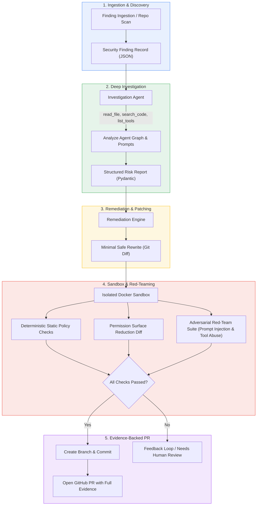
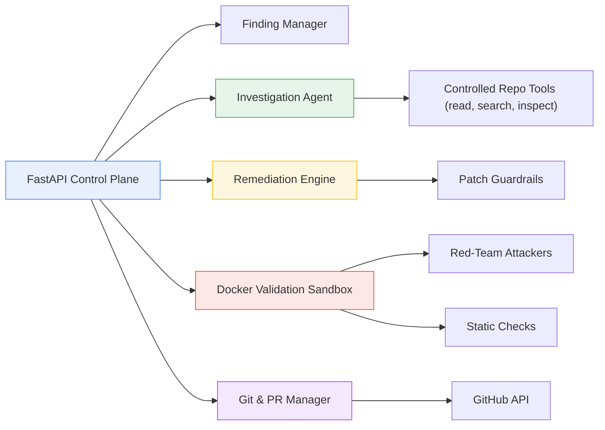
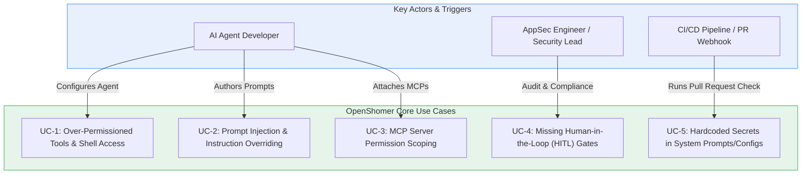
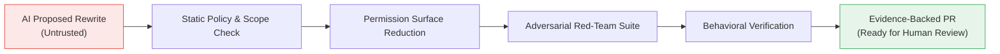

# OpenShomer

**An open-source agentic security engineer for LLM system prompts, agent configs, tool definitions, and MCP servers.**

OpenShomer discovers risky patterns in AI agent configurations, investigates the full agent graph, generates minimal safe rewrites, validates them with adversarial red-teaming inside an isolated Docker sandbox, and opens evidence-backed pull requests.

> Detection is not enough. OpenShomer closes the loop: **Find → Investigate → Rewrite → Red-team → Prove → PR**.

---

## Architecture & Workflows

### End-to-End Remediation Pipeline



### Component Architecture



### Core Use Cases Overview



> 📖 **Full Documentation:**
> - [How It Works (Simple Guide)](docs/HOW_IT_WORKS.md)
> - [Use Cases & Flow Diagrams](docs/USE_CASES.md)
> - [Deep Technical Architecture](docs/ARCHITECTURE.md)

---

## Why OpenShomer?

Traditional AppSec tools ignore the modern AI-agent attack surface:

- System prompts that are overly permissive or susceptible to jailbreaks
- Tools and MCP servers with excessive file, shell, network, or database privileges
- Missing human-in-the-loop (HITL) approval gates on destructive operations
- Indirect prompt-injection and data-exfiltration surfaces
- Overly broad agent skills that can be hijacked

Most existing security tools only **detect** and generate noisy alerts. Almost nothing **remediates** with verifiable proof.

OpenShomer treats AI agent configuration as first-class code that must be investigated, fixed, and proven safe before it reaches a human reviewer.

```
Traditional:  Risky Prompt / Config → Issue / Alert (Noise)
OpenShomer:   Risky Prompt / Config → Investigate → Minimal Rewrite → Adversarial Sandbox Validation → Evidence-backed PR
```

---

## MVP Summary (v0.1)

The first version is deliberately narrow and high-confidence: **close the loop on the most common and dangerous AI-agent configuration risks.**

### What OpenShomer Does in the MVP
- **Ingests / Scans** findings about system prompts, tool definitions, and MCP server configurations
- **Investigates** the agent codebase using strictly controlled, read-only tools
- **Generates** a minimal safe rewrite targeting only affected configuration files
- **Validates** the rewrite inside an isolated Docker sandbox using:
  - Static permission checks & policy diffs
  - Adversarial red-team suite (prompt injection + tool abuse tests)
- **Opens** a GitHub Pull Request only if every single check passes, complete with cryptographic/execution evidence

### Explicitly Out of Scope for MVP
- Full multi-agent orchestration graphs (beyond single agent + tools)
- Full RAG & vector database retrieval pipelines
- Runtime monitoring / live in-flight agent firewalls
- Auto-merging pull requests without human review

---

## Security Model



- **Zero Implicit Trust:** AI output is never trusted by default.
- **Deterministic Disposing:** AI proposes patches, but deterministic rules and adversarial red-teaming decide acceptance.
- **Minimal Blast Radius:** Patches are strictly scoped to affected configuration files.
- **Human Authority:** Human reviewers retain the final merge decision on all generated PRs.

---

## Example Flow

### 1. Input Finding
```json
{
  "id": "SHOMER-001",
  "type": "OVER_PERMISSIONED_TOOL",
  "severity": "HIGH",
  "file": "agent/tools.yaml",
  "tool": "run_shell",
  "issue": "Shell tool has no human approval gate and unrestricted command scope",
  "repository": "customer-support-agent"
}
```

### 2. Investigation Result
```json
{
  "finding": "SHOMER-001",
  "root_cause": "run_shell tool lacks approval gate and command allow-list",
  "affected_files": ["agent/tools.yaml", "prompts/system.md"],
  "recommended_fix": "Add human-in-the-loop gate + restrict to safe command prefix",
  "confidence": 0.95,
  "risk": "HIGH"
}
```

### 3. Minimal Rewrite Diff
```diff
- name: run_shell
-   description: Execute any shell command
-   permissions: ["shell:unrestricted"]
+ name: run_shell
+   description: Execute approved shell commands only
+   permissions: ["shell:restricted"]
+   requires_approval: true
+   allowed_prefixes: ["ls", "cat", "grep", "echo"]
```

### 4. Validation Report
```
✓ Permission surface reduced: shell:unrestricted -> shell:restricted
✓ Guardrails passed: Scope and file size limits respected
✓ Adversarial injection tests: 12/12 blocked
✓ No new high-risk capabilities introduced
Result: APPROVED FOR PR
```

---

## Project Structure

```
OpenShomer/
├── .github/
│   ├── workflows/
│   │   ├── assign-bot.yml           # Auto-assign reviewers
│   │   ├── lgtm-automerge.yml       # Auto-merge on LGTM
│   │   ├── welcome-bot.yml          # Welcome new contributors
│   │   ├── labeler.yml              # Auto-label PRs
│   │   ├── stale.yml                # Stale issue/PR management
│   │   ├── help-bot.yml             # Help request bot
│   │   └── ci.yml                   # CI workflow running automated test matrix
│   ├── PULL_REQUEST_TEMPLATE.md     # Standard PR submission checklist
│   └── ISSUE_TEMPLATE/              # Bug & feature request templates
├── app/
│   ├── api/
│   │   ├── findings.py              # REST endpoints (Ingest, Investigate, Remediate, Validate, Resolve)
│   │   └── mulerun.py               # MuleRun webhook & live telemetry endpoints
│   ├── mulerun/
│   │   ├── runtime.py               # MuleRun AI workflow runtime & Qwen reasoning gateway
│   │   └── webhooks.py              # GitHub webhook HMAC-SHA256 ingress verifier
│   ├── qoderwork/
│   │   └── agent.py                 # QoderWork desktop agent (Trigger -> Investigate -> Action -> Resolved)
│   ├── qoder/
│   │   ├── ide.py                   # Qoder agentic IDE engine
│   │   ├── diff_synthesizer.py      # AST & schema least-privilege diff synthesizer
│   │   └── prompt_fencing.py        # Defensive XML prompt fence generator
│   ├── frameworks/
│   │   ├── skills.py                # Skill files (SKILL.md, skills/*) security scanner
│   │   ├── langchain.py             # LangChain tool and runaway executor scanner
│   │   ├── llamaindex.py            # LlamaIndex FunctionTool & ReActAgent scanner
│   │   └── crewai.py                # CrewAI multi-agent delegation scanner
│   ├── models/
│   │   └── findings.py              # Pydantic schemas (Finding, Severity, InvestigationResult, etc.)
│   ├── agents/
│   │   ├── tools.py                 # Read-only repo tools (read_file, search_code, list_tools)
│   │   ├── investigator.py          # Deep prompt/tool/MCP investigation agent
│   │   ├── remediation.py           # Minimal safe rewrite generator
│   │   ├── providers.py             # Alibaba Cloud Qwen, OpenAI & LLM providers
│   │   └── schemas.py
│   ├── validation/
│   │   ├── guardrails.py            # Scope, size, and permission reduction checks
│   │   ├── static.py                # Static policy inspection
│   │   ├── redteam.py               # Adversarial test runner
│   │   └── sandbox.py               # Isolated sandbox execution runner
│   ├── github/
│   │   ├── branches.py              # Git branch creator
│   │   ├── commits.py               # Git staging and commit manager
│   │   └── pull_requests.py         # Evidence-backed PR generator
│   └── main.py                      # FastAPI application entrypoint
├── demo/
│   └── vulnerable-agent/            # Vulnerable demo target fixture
├── docs/
│   ├── ARCHITECTURE.md              # Technical architecture & state machine diagrams
│   ├── USE_CASES.md                 # Use cases, sequences, and threat models
├── redteam/
│   └── suites/                      # Adversarial test suites for prompt injection & tool abuse
├── tests/                           # Automated test suites
├── .env.example
├── Dockerfile & docker-compose.yml
├── Makefile                         # Developer commands (make test, make run)
├── pyproject.toml
├── uv.lock
├── CONTRIBUTING.md                  # Contributor guidelines
├── CODE_OF_CONDUCT.md               # Contributor Covenant Code of Conduct
├── SECURITY.md                      # Security and coordinated disclosure policy
├── LICENSE
└── README.md
```

---

## Quick Start

Install [uv](https://docs.astral.sh/uv/) first (`curl -LsSf https://astral.sh/uv/install.sh | sh`, `brew install uv`, or `winget install astral-sh.uv`).

```bash
# Clone the repository
git clone https://github.com/kavix/OpenShomer.git
cd OpenShomer

# Install dependencies
make install

# Run test suite
make test

# Start OpenShomer API
make run
```

### Model Context Protocol (MCP) Server

Connect OpenShomer directly to **Claude Desktop**, **Claude Code**, **Cursor**, or **Windsurf** to audit agent prompts and configurations in real time.

#### Claude Desktop Configuration (`claude_desktop_config.json`)

```json
{
  "mcpServers": {
    "openshomer": {
      "command": "uvx",
      "args": ["--from", "openshomer", "openshomer-mcp"]
    }
  }
}
```

#### Exposed MCP Security Tools
- `scan_agent_config(path)`: Scans agent codebase for tool permissions, missing approval gates, and prompt risks.
- `redteam_prompt(prompt_text)`: Evaluates system prompts against 26 adversarial prompt injection & leak vectors.
- `audit_mcp_config(config_json)`: Validates MCP server permissions and checks for hardcoded API keys.

### CLI Usage

```bash
# Scan a local agent repository for security misconfigurations
openshomer scan demo/vulnerable-agent

# Output findings as machine-readable JSON for CI/CD gates
openshomer scan demo/vulnerable-agent --json

# Run autonomous remediation and open an evidence-backed Pull Request
openshomer fix demo/vulnerable-agent --auto-pr

# Run remediation powered by Alibaba Cloud Qwen reasoning
openshomer fix demo/vulnerable-agent --provider alibaba --model qwen-plus --auto-pr
```

### GitHub Actions CI/CD Integration

Add OpenShomer to `.github/workflows/agent-security.yml` to automatically scan every Pull Request:

```yaml
name: AI Agent Security Audit

on:
  pull_request:
    branches: [main]

jobs:
  audit:
    runs-on: ubuntu-latest
    steps:
      - uses: actions/checkout@v4
      - name: OpenShomer Security Scan
        uses: kavix/OpenShomer@main
        with:
          github_token: ${{ secrets.GITHUB_TOKEN }}
          scan_path: "."
          exit_code: "true"
          dashscope_api_key: ${{ secrets.DASHSCOPE_API_KEY }}
```

## Supported LLM Providers

OpenShomer features dynamic multi-provider reasoning with native support for:

- **Alibaba Cloud Model Studio (Bailian / DashScope)**: `qwen-max`, `qwen-plus`, `qwen-turbo`, `qwen-coder-plus` (`DASHSCOPE_API_KEY` or `ALIBABA_CLOUD_API_KEY`)
- **Anthropic**: `claude-3-5-sonnet`, `claude-3-haiku` (`ANTHROPIC_API_KEY`)
- **Google Gemini**: `gemini-1.5-pro`, `gemini-1.5-flash` (`GEMINI_API_KEY`)
- **OpenAI**: `gpt-4o`, `gpt-4o-mini` (`OPENAI_API_KEY`)
- **Mistral AI**: `mistral-large`, `codestral` (`MISTRAL_API_KEY`)
- **NVIDIA NIM**: `meta/llama-3.1-70b-instruct` (`NVIDIA_API_KEY`)

*Note: OpenShomer operates with zero required external dependencies in zero-config mode, falling back to deterministic AST and policy verification if no API keys are set.*


Without Make: `uv sync`, `uv run pytest -v`, and `uv run uvicorn app.main:app --reload --host 0.0.0.0 --port 8000`.

The API will be available at `http://localhost:8000` with interactive Swagger docs at `http://localhost:8000/docs`.

---

## Roadmap

| Version | Focus                              | Highlights                                      |
|---------|------------------------------------|-------------------------------------------------|
| **v0.1**    | Core Loop (MVP)                    | System prompts + tool/MCP configs, basic red-team, GitHub PRs |
| v0.2    | Richer Agent Graphs                | Multi-tool agents, skill files, LangChain/LlamaIndex support |
| v0.3    | Advanced Red-Teaming               | Adaptive attackers, multi-turn jailbreaks, tool-chaining attacks |
| v0.4    | RAG & Memory Security              | Vector store permissions, retrieval prompt hardening |
| v0.5    | Runtime Feedback Loop              | Ingest live agent traces and close the loop from production |

---

## Contributing & Community

Contributions are welcome! Please see our [Contributing Guide](CONTRIBUTING.md) and [Code of Conduct](CODE_OF_CONDUCT.md) for guidelines on how to get involved.

For security vulnerabilities, please refer to our [Security Policy](SECURITY.md).

---

## License

[MIT](LICENSE)

---

**OpenShomer**  
*Find the risky agent config. Rewrite it safely. Prove the attack path is closed. Open the PR.*
