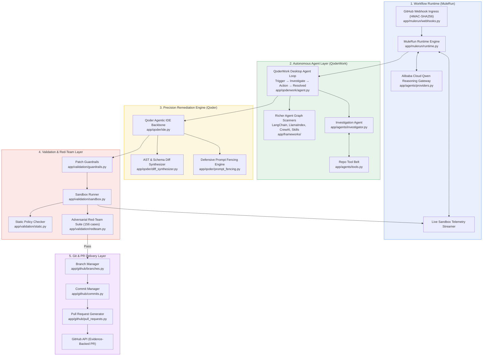
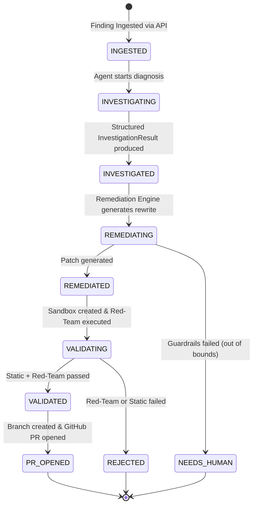
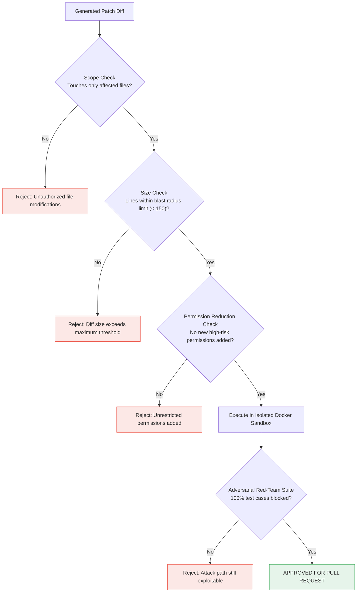

# OpenShomer — Deep Technical Architecture

This document provides a comprehensive technical breakdown of OpenShomer's architectural components, data contracts, validation lifecycles, and security boundary guarantees.

---

## 🏛️ System Architecture

---

## 🔄 Finding Lifecycle & State Machine

---

## 🛡️ Validation & Guardrail Decision Flow

---

## 🔒 Security Guarantees
1. **Read-Only Investigation:** Agent inspection tools cannot modify workspace files or run shell commands outside the target repo boundary.
2. **Deterministic Disposal:** LLM proposals are validated by strict Python guardrails and deterministic regex before entering the sandbox.
3. **Isolated Test Execution:** Red-team tests run in ephemeral sandbox directories/Docker containers isolated from host credentials.
4. **Non-Destructive Git Operations:** Patches are committed to isolated security branches; `main` branch is never touched directly.
