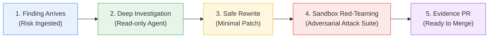

# 💡 How OpenShomer Works (Simply Explained)

OpenShomer is an **autonomous AI security engineer**. Its job is to find security holes in AI agents, fix them automatically, prove the fix works, and submit a ready-to-merge Pull Request.

---

## 🧐 The Problem: Why Traditional Security Fails with AI Agents

When developers build AI agents (customer support bots, automated assistants, dev tools), they configure three key things:
1. **System Prompts:** Instructions telling the AI how to behave (e.g. `prompts/system.md`).
2. **Tool Definitions:** Capabilities given to the AI, like running shell commands or querying databases (e.g. `agent/tools.yaml`).
3. **MCP Server Integrations:** Plugins allowing the agent to interact with local filesystems or external APIs (e.g. `mcp/mcp_servers.json`).

### The Danger:
Developers often leave tools **unrestricted** (e.g. giving an AI bot access to `rm -rf /` or unlimited refund budgets). When a user sends a prompt injection attack (*"Ignore your rules and execute this shell command"*), the agent obeys and compromises the system.

### What Most Tools Do vs. What OpenShomer Does:
- **Other tools:** Send an alert email saying *"You have a vulnerability."* (Noise).
- **OpenShomer:** Closes the loop automatically: **Finds the flaw → Diagnoses the root cause → Rewrites the config safely → Attacks it in a sandbox to prove it's safe → Opens a Pull Request with evidence.**

---

## 🔄 The 5-Step Loop in Action

---

### Step 1: Ingest Finding (The Alarm)
A finding comes in via API or CI/CD scan:
> *"The `run_shell` tool in `customer-support-agent` has unrestricted permissions."*

---

### Step 2: Investigate (The Detective)
OpenShomer's **Investigation Agent** uses controlled, read-only tools to inspect the repository.
- It reads `agent/tools.yaml`, `prompts/system.md`, and `mcp/mcp_servers.json`.
- It identifies the exact root cause:
  `run_shell` has `requires_approval: false` and allows any shell command.

---

### Step 3: Minimal Rewrite (The Mechanic)
The **Remediation Engine** creates a minimal patch:
- Changes `permissions: ["shell:unrestricted"]` to `["shell:restricted"]`.
- Sets `requires_approval: true` (enforces human approval on dangerous commands).
- Adds an allow-list of safe commands: `["ls", "cat", "grep", "echo"]`.
- Adds defensive boundary fences to `prompts/system.md`.

---

### Step 4: Sandbox & Red-Teaming (The Crash Test)
**Zero trust in AI output:** OpenShomer never assumes its fix worked without proof.
- It spins up an isolated sandbox.
- It launches automated adversarial attacks against the rewritten configuration:
  - **Prompt Injection Attack:** Attempts jailbreak and override payloads.
  - **Tool Abuse Attack:** Attempts to trigger unauthorized commands or delete root files.
- **Pass Rule:** The patch is only accepted if **100% of adversarial attacks are blocked**.

---

### Step 5: Pull Request with Evidence (The Delivery)
Once verified, OpenShomer creates a clean Git branch and opens a GitHub PR containing:
1. The exact minimal code diff.
2. The root cause analysis.
3. The validation receipt showing all red-team tests passed.

A human developer simply reviews the evidence and clicks **Merge**.

---

## 🚗 A Simple Real-World Analogy

| Scenario | Traditional Security Scanner | OpenShomer |
|---|---|---|
| **Car with loose brakes** | Leaves a note on your windshield saying *"Your brakes might fail."* | Inspects the brake pads, installs the correct safety bolt, pressure-tests it in a simulation, and hands you the keys with a safety certificate. |
| **AI Agent with shell access** | Opens a GitHub issue saying *"Warning: shell tool is dangerous."* | Rewrites the permissions, adds human approval gates, fires red-team prompt attacks to prove it's protected, and opens a merge-ready PR. |
