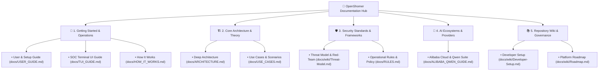

# OpenShomer Documentation Index & Knowledge Map

Welcome to the **OpenShomer Documentation Hub**. This index categorizes all technical guides, architectural specifications, threat models, and integration manuals.

---

## 🗺️ Documentation Knowledge Map

---

## 1. Getting Started & User Guides

| Document | Purpose | Target Audience |
|---|---|---|
| 📖 **[User & Setup Guide](USER_GUIDE.md)** | Step-by-step installation (`brew`, `uv`, source), GitHub PR automation setup, environment configuration, and CI/CD actions. | Developers, DevOps, SecOps |
| 💻 **[Terminal UI (TUI) SOC Guide](TUI_GUIDE.md)** | Keyboard shortcuts, interactive dual-pane dashboard, and live telemetry log operational manual. | SOC Analysts, Developers |
| 💡 **[How It Works](HOW_IT_WORKS.md)** | Conceptual overview of the **Find $\rightarrow$ Investigate $\rightarrow$ Rewrite $\rightarrow$ Red-Team $\rightarrow$ Prove $\rightarrow$ PR** autonomous loop. | General Engineers |

---

## 2. Technical Architecture & Use Cases

| Document | Purpose | Target Audience |
|---|---|---|
| 🏗️ **[Deep Architecture](ARCHITECTURE.md)** | Complete breakdown of **MuleRun** (Workflow Runtime), **Qoder** (AST Synthesizer), and **QoderWork** (Desktop Agent). | Software Architects |
| 📋 **[Use Cases & Flow Scenarios](USE_CASES.md)** | Detailed real-world scenarios across SRE/DevOps, SQL Analytics, Customer Support, and MCP integrations. | AppSec Engineers |

---

## 3. Advanced Integrations & AI Backbones

| Document | Purpose | Target Audience |
|---|---|---|
| 🧠 **[Alibaba Cloud & Qwen Security Suite](ALIBABA_QWEN_GUIDE.md)** | Guide for Qwen-2.5-Coder AST synthesis, Content Guardrails moderation, and high-throughput batch red-teaming. | AI Engineers |

---

## 4. Threat Models, Governance & Wiki

| Document | Purpose | Target Audience |
|---|---|---|
| 🛡️ **[Threat Model & Attack Surface](wiki/Threat-Model.md)** | Analysis of OWASP LLM Top 10, MITRE ATLAS tactics, and prompt injection threat surfaces. | Security Teams |
| 🛠️ **[Developer Setup](wiki/Developer-Setup.md)** | Virtual environments, pytest test execution, `uv` workflows, and Ruff linting standards. | Contributors |
| 🗺️ **[Wiki Roadmap](wiki/Roadmap.md)** | Multi-turn jailbreak simulations, containerized sandboxes, and enterprise roadmaps. | All Stakeholders |
