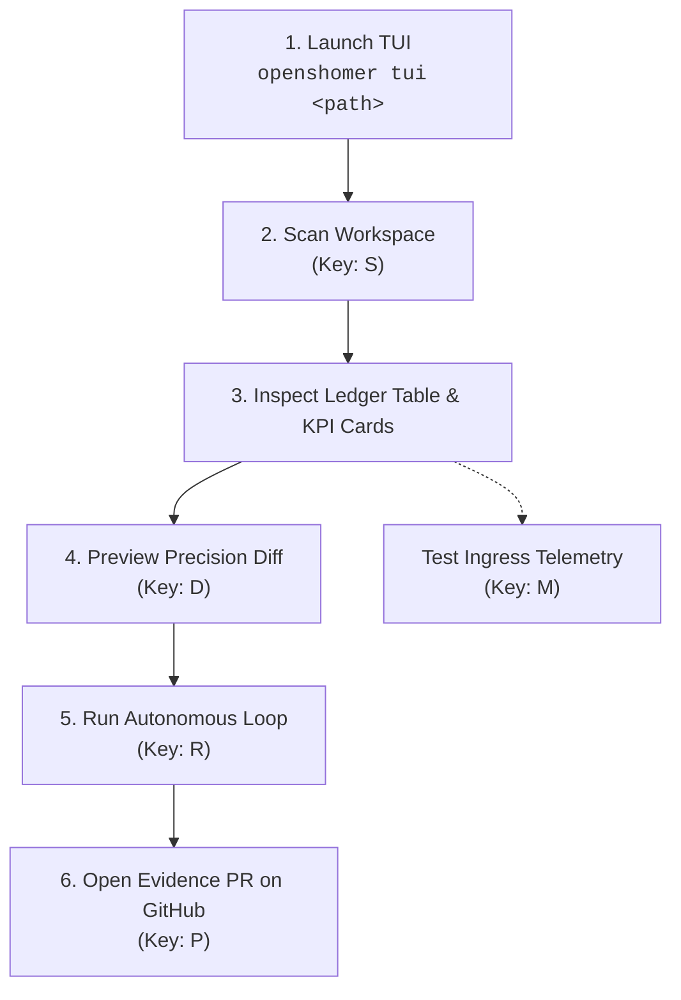

# OpenShomer Terminal User Interface (TUI) Guide

OpenShomer includes an interactive **Textual-based Terminal User Interface (TUI)** designed as a Security Operations Center (SOC) dashboard for AI agent security engineering.

---

## 1. Launching the TUI

To launch the TUI on the current workspace or any target agent repository:

```bash
# Target the current workspace
openshomer tui

# Target a specific agent repository
openshomer tui /path/to/target-agent-repo

# Example: Run on demo vulnerable agent
openshomer tui demo/vulnerable-agent
```

---

## 2. Dashboard Interface Overview

```text
┌───────────────────────────────────────────────┬────────────────────────────────────────────────────────────────────────┐
│  SECURITY CONTROLS                            │  ┌──────────────┐ ┌──────────────┐ ┌──────────────┐ ┌──────────────┐   │
│                                               │  │ WORKSPACE    │ │ FINDINGS     │ │ SANDBOX PASS │ │ ENGINES      │   │
│  1. Scan Workspace       (S)                  │  │ DevOps-Agent │ │ 7 Detected   │ │ 100%         │ │ MuleRun+Qoder│   │
│  2. Trigger MuleRun      (M)                  │  └──────────────┘ └──────────────┘ └──────────────┘ └──────────────┘   │
│  3. Qoder Synthesizer    (D)                  │                                                                        │
│  4. Autonomous Loop      (R)                  │  Status: Audit Complete: 7 security findings identified.               │
│                                               │  ┌──────────────────────────────────────────────────────────────────┐  │
│  DEPLOYMENT & PR                              │  │ Security Findings Ledger     │ Live Telemetry & Execution Log    │  │
│  5. Open Evidence PR     (P)                  │  ├──────────────────────────────────────────────────────────────────┤  │
│  Exit Platform           (Q)                  │  │ [SHOMER-001] | OVER_PERMISSIONED_TOOL | HIGH | agent/tools.yaml  │  │
│                                               │  │ [SHOMER-002] | OVER_PERMISSIONED_TOOL | HIGH | mcp_servers.json  │  │
└───────────────────────────────────────────────┴────────────────────────────────────────────────────────────────────────┘
```

---

## 3. Keyboard Shortcuts & Controls

| Action | Shortcut Key | Description |
|---|---|---|
| **Scan Workspace** | `S` | Scans prompt files, configs, and agent frameworks for vulnerabilities. |
| **Trigger MuleRun** | `M` | Ingests simulated GitHub repository webhook and logs real-time event telemetry. |
| **Qoder Synthesizer** | `D` | Generates feature-preserving AST diffs and XML prompt fences. |
| **Autonomous Loop** | `R` | Executes QoderWork 4-stage cycle (`Trigger` -> `Investigate` -> `Action` -> `Resolved`). |
| **Open Evidence PR** | `P` | Runs 156 sandbox checks, commits to branch, and creates live GitHub PR. |
| **Quit** | `Q` / `Esc` | Exits the TUI. |

---

## 4. End-to-End Operational Flow



### Operational Steps:

1. **Scan (`Key: S`)**: OpenShomer executes static analysis and AST checks across system prompts, tool schemas, MCP configurations, LangChain, LlamaIndex, CrewAI, and skill files.
2. **Review Ledger**: The table populates with Finding ID, Vulnerability Type, Severity Badge (`CRITICAL`, `HIGH`, `MEDIUM`), Target File, and Risk Summary.
3. **MuleRun Telemetry (`Key: M`)**: Verifies event-driven webhook processing and logs execution duration.
4. **Qoder Synthesizer (`Key: D`)**: Injects feature-preserving guardrails (parameter bounds, command allow-lists, query row limits, and XML security fences) without breaking valid application functionality.
5. **QoderWork Autonomous Loop (`Key: R`)**: Runs the full automated remediation cycle and validates 156 adversarial red-team test cases in an isolated container sandbox.
6. **Open Evidence PR (`Key: P`)**: Pushes candidate fixes to a security branch and opens a Pull Request on GitHub with before/after security proof and execution evidence.
